# Relatório da Tarefa 2: Exploração, Clusterização e Resgate

**Autor:** João Pedro de Pieri Batista da Silva - 2424525 - BSI
**Disciplina:** Sistemas Inteligentes – 2025/2
**Professor:** Tacla

---

## 1. Resumo das Técnicas Utilizadas

Este relatório descreve a sequência de técnicas empregadas para resolver o problema de resgate de vítimas em um ambiente desconhecido, dividido em três fases principais: Exploração, Clusterização e Resgate.

1.  **Exploração do Ambiente (`1_exploration.ipynb`):**
    *   **Técnica:** *Online Depth-First Search (DFS)* com divisão de setores.
    *   **Objetivo:** Mapear o máximo de área possível e localizar vítimas dentro de um limite de tempo (`tlim`), distribuindo os agentes por setores para maximizar a cobertura e minimizar a sobreposição, a divisão de setores foi feita com uma função ou sector que retornava em que setor estavam os caminhos possiveis, sem acessar o gabarito.
    *   **Resultado:** Geração de mapas de células conhecidas (`knownmap`) e listas de vítimas encontradas por cada agente com pouco sobreposição.

2.  **Clusterização de Vítimas (`2_clustering.ipynb`):**
    *   **Técnica:** *K-Means Clustering*.
    *   **Objetivo:** Agrupar as vítimas encontradas em diferentes níveis de prioridade para o resgate. A clusterização foi baseada em duas características principais: a chance de sobrevivência (`sobr`) e a classe de triagem (`tri`), que foram previstas usando os modelos treinados na Tarefa 1.
    *   **Resultado:** Criação de 4 arquivos de cluster (`tlim8000_cluster{i}.csv`), onde cada arquivo representa um grupo de prioridade (cluster 1 sendo a mais alta).

3.  **Planejamento de Resgate (`3_rescue.ipynb`):**
    *   **Técnicas:** *K-Means* para setorização, *A\* (A-Star)* para cálculo de custo de rotas e uma **Heurística Gulosa de Inserção** para planejamento.
    *   **Objetivo:** Criar rotas de resgate eficientes para múltiplos agentes, respeitando um limite de "bateria" (custo máximo de 800).
    *   **Resultado:** Um plano de resgate completo, com rotas definidas para cada agente, um resumo de vítimas resgatadas por prioridade e uma lista de vítimas que não puderam ser salvas devido ao limite de custo.

---

## 2. Detalhamento das Fases

### Fase 1: Exploração do Ambiente

A exploração foi a base para todo o processo. Sem um mapa e a localização das vítimas, nenhum planejamento seria possível.

-   **Algoritmo:** Foi utilizado o *Online-DFS*, uma variação do DFS onde o agente toma decisões em tempo real com base no que já descobriu.
-   **Setorização:** Para evitar que os 3 agentes explorassem a mesma área, o ambiente foi dividido em 3 setores angulares a partir da base. Cada agente foi designado a um setor, com uma pequena margem de sobreposição para garantir que nenhuma área limítrofe fosse ignorada.
-   **Limite de Tempo (`tlim`):** A exploração foi executada com dois orçamentos de tempo: 1000 e 8000. Os resultados da exploração com `tlim=8000` foram utilizados nas fases seguintes, por fornecerem um mapa mais completo.
-   **Saídas:** Ao final, os mapas e listas de vítimas de cada agente foram unificados. A tabela abaixo resume os resultados da unificação para os dois limites de tempo:

Abaixo os resultados detalhados da exploração:

**Executando simulação com tlim=1000**
- EXPLORER_1 encontrou 13 vítimas (tempo 0.5172) finalizando em (46, 46)
- EXPLORER_2 encontrou 15 vítimas (tempo 0.5397) finalizando em (46, 46)
- EXPLORER_3 encontrou 3 vítimas (tempo 0.5485) finalizando em (46, 46)

**Executando simulação com tlim=8000**
- EXPLORER_1 encontrou 100 vítimas (tempo 4.0315) finalizando em (46, 46)
- EXPLORER_2 encontrou 95 vítimas (tempo 4.0367) finalizando em (46, 46)
- EXPLORER_3 encontrou 100 vítimas (tempo 4.0185) finalizando em (46, 46)

| Arquivo Unificado                 | Registros Únicos |
| --------------------------------- | ---------------- |
| `tlim1000_knownmap_all.csv`       | 1005             |
| `tlim8000_knownmap_all.csv`       | 6158             |
| `tlim1000_victims_all.csv`        | 31               |
| `tlim8000_victims_all.csv`        | 285              |

Para medir a eficiência da exploração dividida por setores, podemos analisar a sobreposição na descoberta de vítimas. Uma baixa sobreposição indica que os agentes exploraram áreas distintas. A taxa de redundância pode ser calculada como:

- **tlim=1000:** ((13 + 15 + 3) / 408) - 1 = −0.924 
- **tlim=8000:** ((100 + 95 + 100) / 408) - 1 = −0.278 

Onde um valor próximo de 1 significa pouca ou nenhuma sobreposição.

Os resultados da exploração com `tlim=8000` foram utilizados nas fases seguintes, por fornecerem um mapa mais completo, resultando nos arquivos `tlim8000_knownmap_all.csv` e `tlim8000_victims_all.csv`.

## Mapa geral de env_victims + env_obst
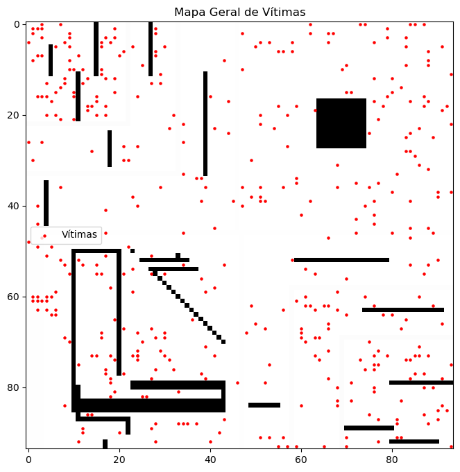

## Exploradores com tlim 1000
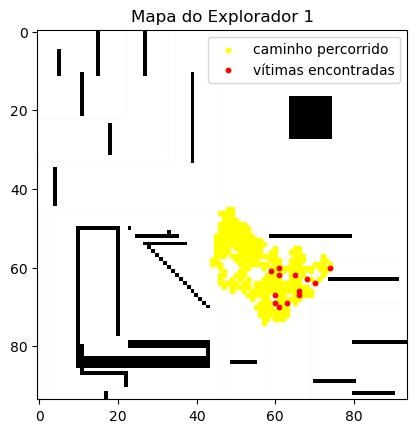
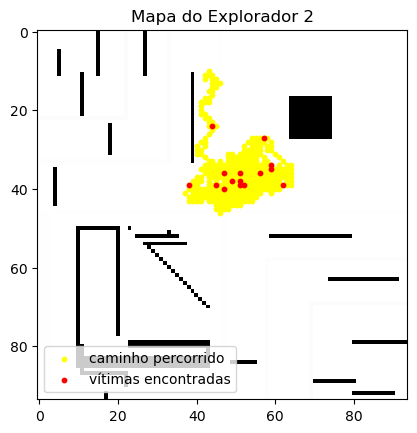
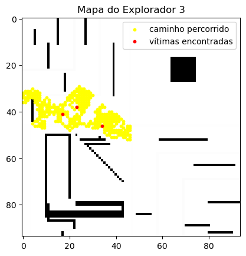
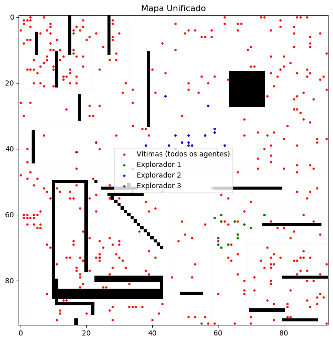

## Exploradores com tlim 8000
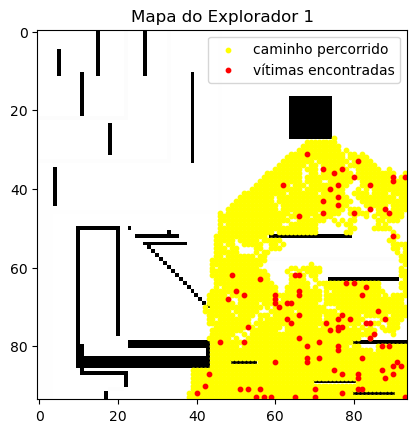
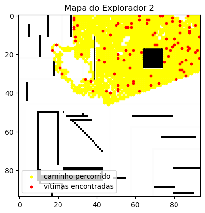
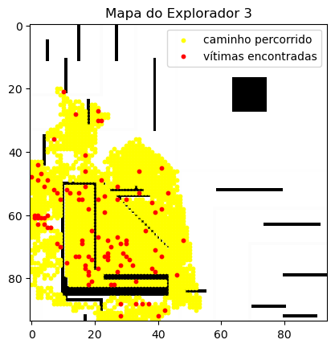
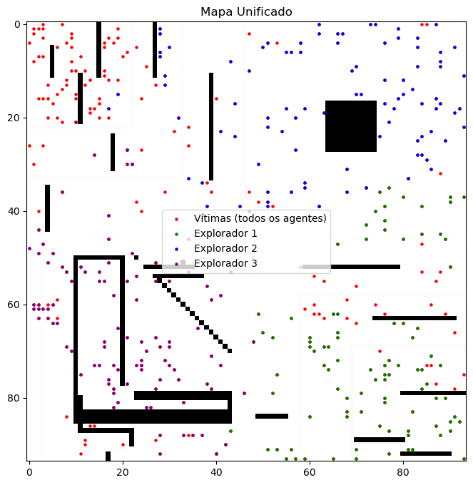

### Fase 2: Clusterização e Priorização de Vítimas

Com a lista de vítimas em mãos, era preciso definir a urgência de cada resgate.

-   **Predição de Atributos:** Utilizando os modelos `classificador_cart_model.pkl` e `regressor_model.pkl` da Tarefa 1, foram previstos os valores de `tri` (triagem) e `sobr` (sobrevivência) para cada vítima encontrada.
-   **Algoritmo K-Means:** As vítimas foram agrupadas em 4 clusters com base nos valores de `tri` e `sobr`. O método do cotovelo (*Elbow Method*) foi utilizado para confirmar que 4 era um número de clusters apropriado para a distribuição dos dados.
## Elbow Method
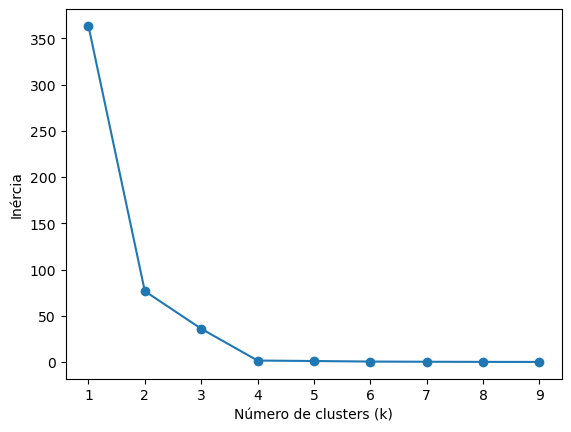
-   **Definição de Prioridade:** Os clusters foram ordenados com base na urgência. O grupo com maior chance de sobrevivência e estado de triagem mais grave foi definido como a prioridade mais alta.
-   **Saídas:** A fase gerou 4 arquivos CSV, um para cada cluster de prioridade (ex: `tlim8000_cluster1.csv` para a prioridade 1). Vale-se ressaltar que caso fosse utilizado apenas os valores de `tri` (triagem) e `sobr` (sobrevivência) os clusters eram obviamente uma simples fatia deles, a utilização dos dois fez um balanceamento, de forma a auxiliar em valores previstos errôneamente. Para o valor de `tri` (triagem) foi utilizado o Classificador CART e `sobr` (sobrevivência) utilizou o Regressor MLP.

## CLusterização com tlim1000
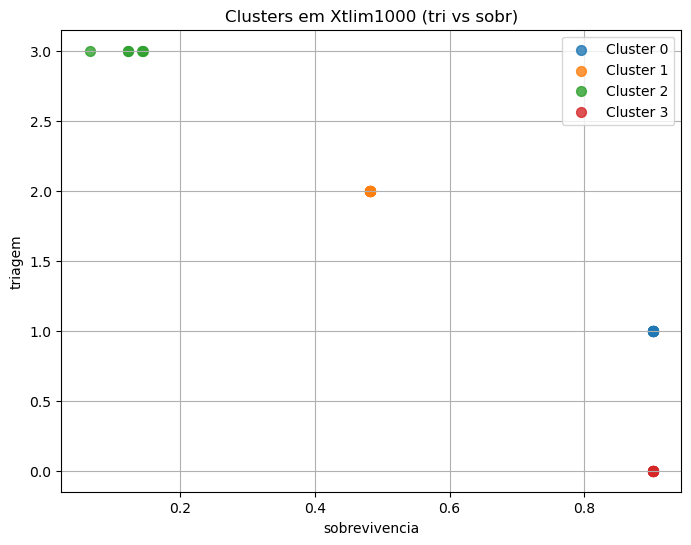

## CLusterização com tlim8000
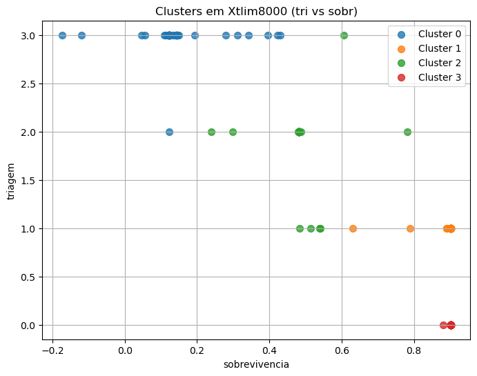

Abaixo os resultados detalhados da clusterização:

| tlim  | Cluster | Linhas exportadas | Caminho do arquivo |
|--------|----------|-------------------|--------------------|
| 1000   | 1        | 9                 | ../results/clustering/tlim1000_cluster1.csv |
| 1000   | 2        | 9                 | ../results/clustering/tlim1000_cluster2.csv |
| 1000   | 3        | 5                 | ../results/clustering/tlim1000_cluster3.csv |
| 1000   | 4        | 8                 | ../results/clustering/tlim1000_cluster4.csv |
| 8000   | 1        | 67                | ../results/clustering/tlim8000_cluster1.csv |
| 8000   | 2        | 69                | ../results/clustering/tlim8000_cluster2.csv |
| 8000   | 3        | 85                | ../results/clustering/tlim8000_cluster3.csv |
| 8000   | 4        | 65                | ../results/clustering/tlim8000_cluster4.csv |

### Fase 3: Planejamento e Resgate

Esta é a fase final, onde a inteligência do sistema é aplicada para salvar o maior número de vidas possível com recursos limitados.

-   **Estratégia "Setorizar e Planejar":** Para garantir que todos os agentes trabalhassem de forma paralela e eficiente, a seguinte abordagem foi adotada:
    1.  **Setorização (K-Means):** Todas as vítimas (já com prioridade definida) foram divididas em 3 grupos (setores) usando K-Means, um para cada agente. Isso distribuiu o trabalho geograficamente.
    2.  **Planejamento com Limite de Custo:** Cada agente, então, planejou sua rota *apenas dentro do seu setor de vítimas*, utilizando a função `plan_route_with_limit`.

-   **Função `plan_route_with_limit`:**
    -   **Funcionamento:** É uma heurística gulosa e incremental. A cada passo, o algoritmo avalia todas as vítimas ainda não visitadas em seu setor.
    -   **Critério de Escolha:** Ele escolhe inserir na rota a vítima que oferece o melhor "custo-benefício", calculado por uma ponderação entre o custo extra para adicioná-la à rota e sua prioridade. Vítimas de maior prioridade recebem um "desconto" no custo, incentivando seu resgate.
    -   **Restrição de Bateria:** Uma vítima só é adicionada se o custo total da rota, após sua inserção, não ultrapassar o `MAX_COST_PER_AGENT` de 800.
    -   **Saídas:** A função retorna a rota final e uma lista de vítimas "órfãs" (aquelas que não puderam ser resgatadas por falta de orçamento).

-   **Cálculo de Custo (A*):** O custo de deslocamento entre quaisquer dois pontos no mapa conhecido foi calculado usando o algoritmo A*, que garante o caminho de menor custo. Um cache foi implementado para armazenar rotas já calculadas, otimizando a performance.

## Socorrista 1 — Setor com **106 vítimas**

| Métrica | Valor |
|----------|--------|
| Vítimas resgatadas | **91** |
| Custo total da rota | **795.50 / 800** |
| Vítimas não resgatadas (sem orçamento) | **15** |

---

## Socorrista 2 — Setor com **102 vítimas**

| Métrica | Valor |
|----------|--------|
| Vítimas resgatadas | **89** |
| Custo total da rota | **511.00 / 800** |
| Vítimas não resgatadas (sem orçamento) | **13** |

---

## Socorrista 3 — Setor com **78 vítimas**

| Métrica | Valor |
|----------|--------|
| Vítimas resgatadas | **74** |
| Custo total da rota | **613.50 / 800** |
| Vítimas não resgatadas (sem orçamento) | **4** |

---

## Resumo Geral do Planejamento

| Indicador | Valor |
|------------|--------|
| Total de vítimas resgatadas | **254** |
| Total de vítimas não resgatadas (órfãs) | **32** |

### Contagem de resgatados por prioridade

| Prioridade | Vítimas |
|-------------|----------|
| 1 | 61 |
| 2 | 61 |
| 3 | 77 |
| 4 | 55 |

## Mapa de Resgate
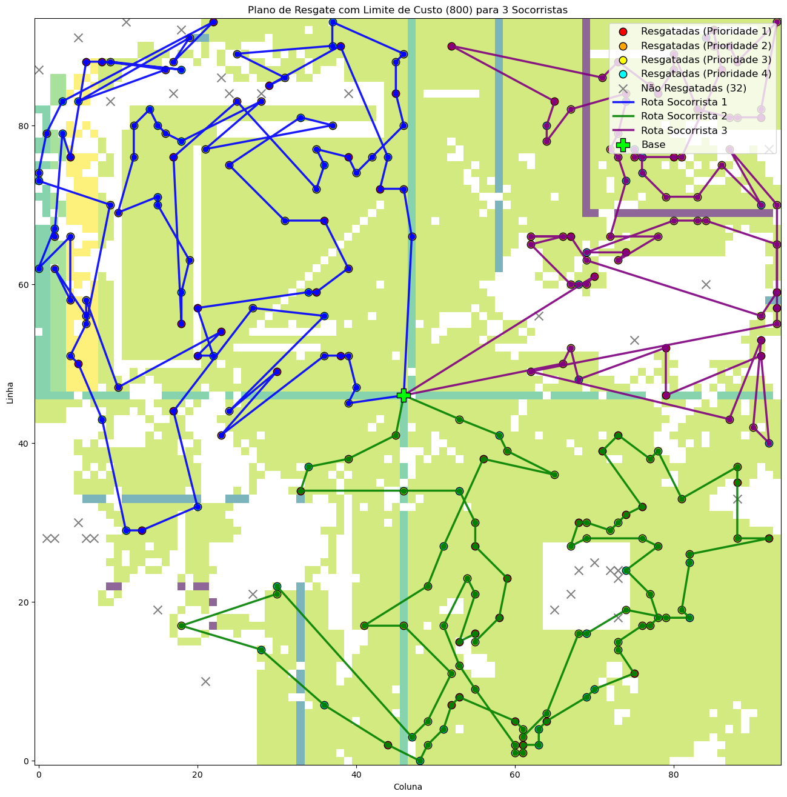

---

## 3. Conclusão Geral

A solução desenvolvida demonstrou uma abordagem robusta e multicamada para um problema complexo de busca e resgate. A separação clara das fases de **Exploração**, **Clusterização** e **Planejamento** permitiu aplicar a técnica mais adequada para cada desafio.

A combinação da setorização geográfica dos agentes com um planejamento de rota individual, que é ao mesmo tempo guloso e consciente das prioridades e dos limites de custo, resultou em um sistema capaz de tomar decisões inteligentes para maximizar o número de vidas salvas. O relatório final, detalhando vítimas resgatadas por prioridade e as não resgatadas, fornece uma visão clara da eficácia da estratégia e permite análises futuras sobre como otimizar ainda mais o processo.

O projeto foi realizado individualmente.